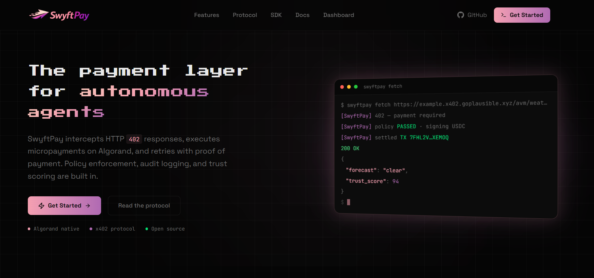
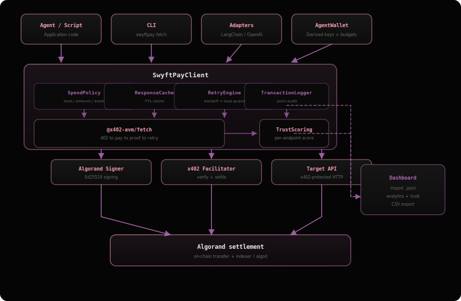

<p align="center">
  
</p>

<h1 align="center">SwyftPay</h1>

<p align="center">
  <strong>Agent payment infrastructure for the open web</strong>
</p>

<p align="center">
  
  
  
  
  
  
</p>

<p align="center">
  <a href="https://github.com/VihaShomikha/SwyftPay.git">GitHub</a> ·
  <a href="CHANGELOG.md">Changelog</a> ·
  <a href="https://algorand.co/agentic-commerce/x402/developers">x402</a>
</p>

<p align="center">
  
</p>

---

## Features

- Automatic **HTTP 402** handling: parse challenge, pay on Algorand, retry with proof
- **Spend policy** before any signature (amount, host allowlist, ASA allowlist)
- **JSON Lines** audit log with queries and CSV export from the web dashboard
- **Retries** with backoff and **payment-loop** guard
- **Simulation** and **response cache** to save cost in staging and repeat calls
- **Trust scores** per API from your own payment history
- **Multi-agent** derived wallets and daily or lifetime **budgets**
- **CLI** plus **LangChain / OpenAI / AutoGPT-shaped** adapters

---

## Architecture

<p align="center">
  
</p>

---

## Quick start

```bash
git clone https://github.com/VihaShomikha/SwyftPay.git
cd SwyftPay
npm install
cp .env.template .env
# 1) Set DEPLOYER_MNEMONIC (25-word TestNet phrase), then:
npm run key:convert
# 2) Copy printed AVM_PRIVATE_KEY, AVM_ADDRESS, RESOURCE_PAY_TO into .env
npm run build
```

**Run x402 payments (CLI wrapper):** the `swyftpay` binary is produced by `npm run build`. Use `npx` so you do not need a global install:

```bash
npx swyftpay balance
npx swyftpay simulate https://example.x402.goplausible.xyz/avm/weather
npx swyftpay fetch https://example.x402.goplausible.xyz/avm/weather
npx swyftpay logs --paid
npx swyftpay trust
```

**Runnable demos (same `.env` with `AVM_PRIVATE_KEY`):**

```bash
npm run demo:all          # full feature walkthrough (policy, logs, retries, GoPlausible)
npm run demo:policy       # spend policy + JSON Lines logging
npm run demo:retry        # retries + payment-loop guard
npm run dev:client        # basic client: GoPlausible + optional localhost
npm run dev:server        # local x402 Express server (run in another terminal before dev:client)
```

**Live demo checklist:** see [demo_script.md](./demo_script.md).

---

## Snippets

**SDK** - `SwyftPayClient` is the main entry: it wraps `fetch`, applies policy, cache, retries, and logging.

```typescript
import { SwyftPayClient } from "swyftpay";

const client = new SwyftPayClient({
  avmPrivateKey: process.env.AVM_PRIVATE_KEY!,
  spendPolicy: { maxAmountPerRequest: BigInt(10_000), allowedHosts: ["*.goplausible.xyz"] },
  logFilePath: "logs/transactions.jsonl",
  cacheTtlMs: 60_000,
});
const res = await client.get("https://example.x402.goplausible.xyz/avm/weather");
```

**Multi-agent wallets** - `AgentWalletManager` derives one Algorand key per agent id from a master key and attaches per-agent `SwyftPayClient` instances and log paths.

```typescript
import { AgentWalletManager } from "swyftpay/agents";
const manager = new AgentWalletManager(process.env.AVM_PRIVATE_KEY!);
manager.createAgent("bot", "Bot", { totalLimit: 100_000_000n, dailyLimit: 10_000_000n, alertThreshold: 0.8 });
await manager.getClient("bot").get("https://...");
```

**Adapters** - Thin wrappers that expose `execute({ url })` and helpers that match LangChain, OpenAI tools, or AutoGPT command shapes.

```typescript
import { SwyftPayLangChainTool } from "swyftpay/adapters";
new SwyftPayLangChainTool({ avmPrivateKey: "..." }).toToolDefinition();
```

---

## Repo layout

| Path | Role |
| - | - |
| `src/` | SDK: client, policy, logger, retry, cache, trust, agents, adapters, CLI |
| `tests/` | Vitest unit + TestNet integration |
| `examples/` | Runnable demos |
| `projects/SwyftPay-frontend/` | React site, docs page, dashboard |

---

## Scripts

| Command | Purpose |
| - | - |
| `npm run build` | Compile SDK to `dist/` |
| `npm test` | 92 tests |
| `npm run demo:all` | Full feature demo (x402 + policy + logs + retries) |
| `npm run demo:policy` | Policy + JSON Lines logging demo |
| `npm run demo:retry` | Retries + payment-loop demo |
| `npm run dev:client` | Basic x402 client (GoPlausible + optional local server) |
| `npm run dev:server` | Local x402 Express server (`PORT`, default 4021) |
| `npx swyftpay fetch <url>` | CLI: pay on 402 and retry with proof |
| `npx swyftpay simulate <url>` | CLI: dry-run (no signature) |
| `npm run key:convert` | Mnemonic to keys |
| `cd projects/SwyftPay-frontend && npm run dev` | Website on port 5173 |

**Network:** Algorand TestNet; facilitator at [GoPlausible](https://facilitator.goplausible.xyz); txs on [Allo.info](https://allo.info).
